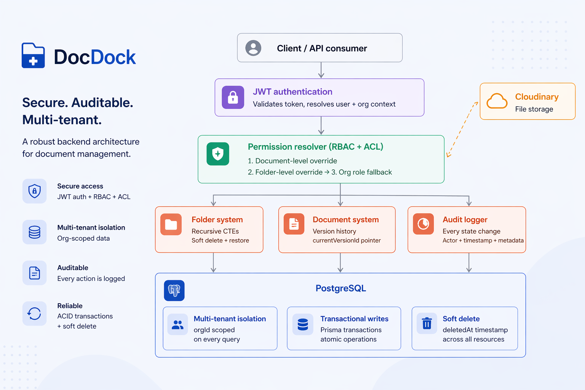
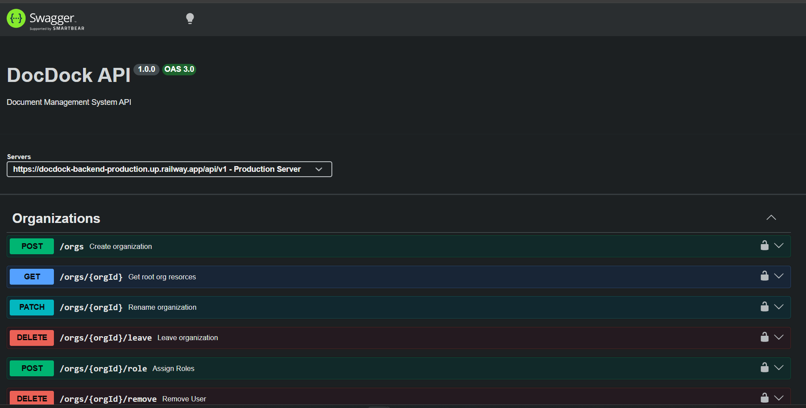
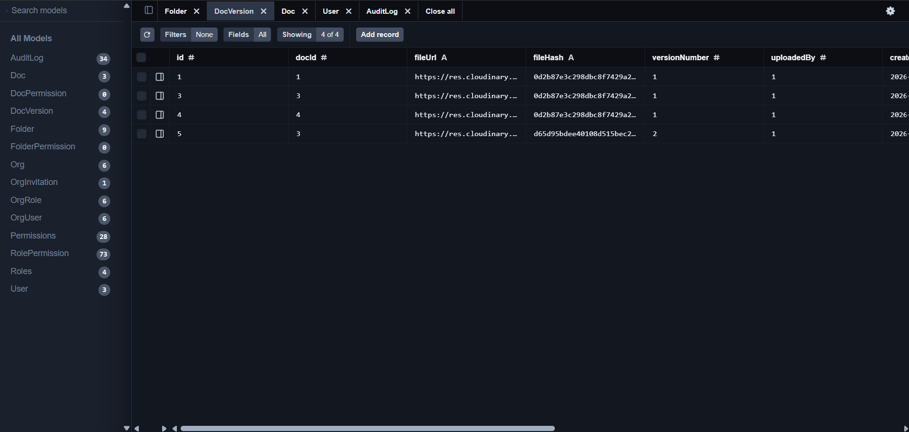

# 🚀 DocDock

### Multi-Tenant Document Management System

Production-ready SaaS backend demonstrating multi-tenancy, RBAC + ACL authorization, document versioning, audit logging, recursive folder hierarchies, and transactional integrity.

[](https://YOUR_POSTMAN_COLLECTION_URL)
[](https://docdock-backend-production.up.railway.app/api-docs)
[](https://docdock-backend-production.up.railway.app)
[](SETUP.md)

---

## 🏗 Architecture



---

**DocDock** is a production-grade, SaaS-ready backend for enterprise document management.

It demonstrates modern backend engineering principles including:

- Multi-tenant architecture
- Version-controlled document storage
- Fine-grained authorization (RBAC + ACL)
- Transaction-safe operations
- Recursive folder hierarchies
- Audit logging
- Production-ready deployment

Designed to showcase **advanced backend architecture**, **data integrity**, and **real-world system design patterns**.

---

## 📸 Screenshots

### Swagger Documentation



---

### Prisma Studio



---

## 🧠 What This Project Solves

Modern organizations require:

- Secure document storage
- Version tracking without data loss
- Controlled access management
- Recoverable delete workflows
- Structured folder hierarchies

DocDock delivers all of the above with:

- Strong multi-tenant isolation
- RBAC + ACL authorization
- Recursive folder operations
- Full audit logging
- Transactional safety

---

## 🛠 Tech Stack

- Node.js
- Express.js
- Prisma ORM
- PostgreSQL
- Cloudinary
- JWT Authentication
- Swagger / OpenAPI
- Docker
- Docker Compose
- Railway
- Jest

---

## 🚀 Deployment

The application is containerized using Docker and deployed on Railway.

### Production Stack

- Railway (API Hosting)
- Supabase PostgreSQL
- Cloudinary Storage
- Swagger / OpenAPI Documentation

---

## ⚡ Quick Start

### Local Development

```bash
npm install
cp .env.sample .env

npx prisma migrate deploy

npm run dev
```

### Docker Development

```bash
docker compose up -d

docker compose exec api npx prisma migrate deploy
```

---

## 📚 API Documentation

Interactive Swagger UI:

<https://docdock-backend-production.up.railway.app/api-docs>

Documented endpoints include:

- Authentication
- Organizations
- Folder Management
- Documents
- Document Versioning
- Folder/Document ACL
- Invitations

---

## 🔐 Core Features

### 🏢 Multi-Tenancy

- Organizations act as isolated tenants
- Users can belong to multiple organizations
- Resources are strictly scoped by `orgId`
- Cross-tenant access prevention

---

### 🔑 Role-Based Access Control (RBAC)

Organization-level roles:

- OWNER
- ADMIN
- EDITOR
- VIEWER

Permission enforcement includes:

- `document.create`
- `document.delete`
- `folder.update`
- and more...

---

### 🛂 ACL Overrides

Supports resource-level permission overrides.

Features include:

- Folder-level ACL
- Document-level ACL

Permission resolution order:

1. Document override
2. Folder override
3. Organization role permissions

Supports explicit `ALLOW` / `DENY` behavior.

---

### 📁 Folder System

- Unlimited nested folders
- Recursive CTE-based subtree operations
- Cycle prevention during move operations
- Recursive soft delete
- Recursive restore
- Intelligent restore behavior when parents no longer exist

---

### 📄 Document System

Document model:

- `Doc` → Logical document
- `DocVersion` → Physical file versions

Features:

- Full version history
- Upload new versions
- Safe rename & move
- Soft delete
- Restore previous versions

---

### 🗑 Soft Delete & Restore

- Timestamp-based deletion (`deletedAt`)
- Fully reversible operations
- Recursive folder deletion
- Intelligent restoration logic
- No automatic permanent data loss

---

### 🧾 Audit Logging

Critical actions are recorded, including:

- Document creation
- Version updates
- Folder operations
- Delete & restore events

Audit entries include:

- Actor
- Action
- Organization
- Resource type
- Resource ID
- Metadata
- Timestamp

---

## 🗄 Database Design

Core entities include:

- User
- Organization
- OrgUser
- Folder
- Document
- DocumentVersion
- Role
- Permission
- AuditLog

### Entity Relationship Diagram



---

## ✅ Testing

Run the test suite:

```bash
npm test
```

---

## 🏗 Engineering Highlights

- Recursive SQL (CTEs) for subtree traversal
- Transactional integrity using Prisma
- Database-level uniqueness constraints
- Cross-tenant isolation
- Soft delete strategy across all resources
- Clean separation of concerns
- Enterprise-grade restore behavior
- Modular service architecture

---

## 📈 Why This Project Matters

DocDock is **not** a CRUD demonstration.

It showcases:

- Real SaaS multi-tenant architecture
- Complex permission resolution
- Recursive tree structures in relational databases
- SQL-based version control modeling
- Production-safe delete & restore workflows
- Strong transactional guarantees
- Enterprise backend design principles

---

## 🎯 Project Status

✅ Multi-tenant architecture

✅ RBAC authorization

✅ ACL permission overrides

✅ Folder lifecycle

✅ Document lifecycle

✅ Version control

✅ Audit logging

✅ Transaction-safe operations

✅ Dockerized deployment

✅ Production deployment on Railway

---

DocDock is a production-oriented backend project focused on scalable SaaS architecture, enterprise document management, and modern backend engineering best practices.
